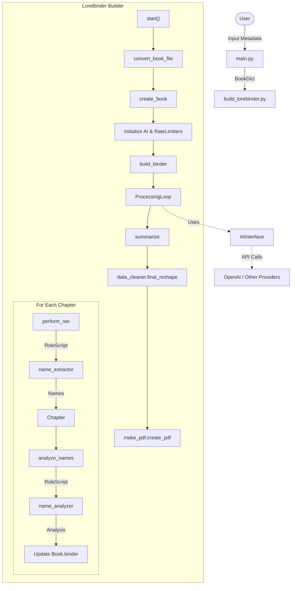
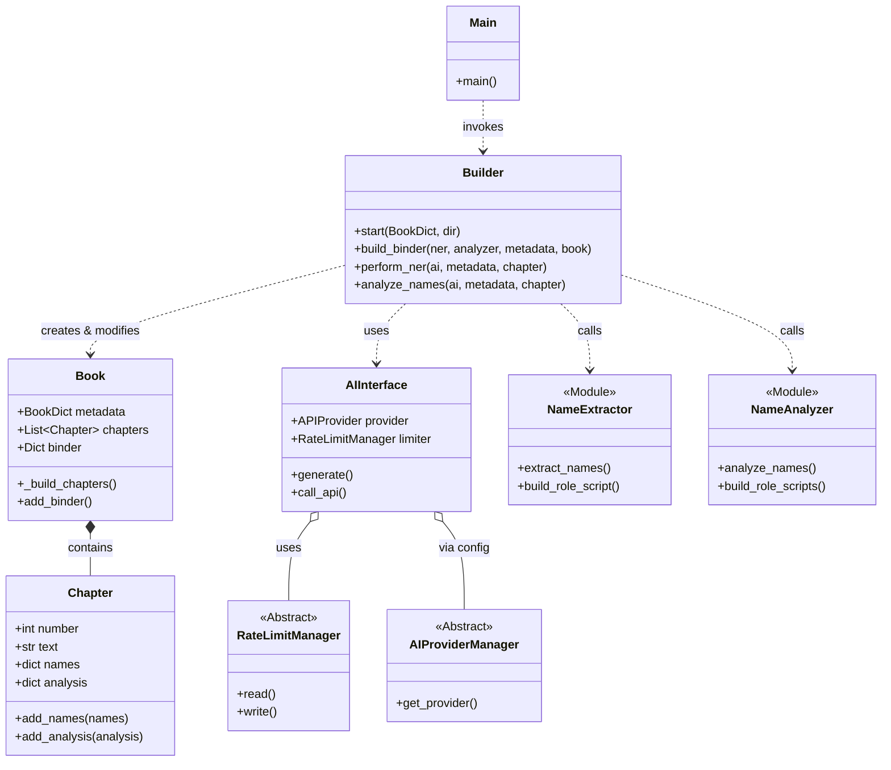

# LoreBinders Architecture

## Directory Structure

```txt
src/lorebinders/
├── main.py                     # Application Entry Point
├── build_lorebinder.py         # Main Orchestrator responsible for the build process
├── book.py                     # Domain Model: Book and Chapter classes
├── start_ai_initialization.py  # Factory for AI Providers & Rate Limiters
├── user_input.py               # CLI User Input Handling
├── _managers.py                # Abstract Base Classes (RateLimit, AIProvider, etc.)
├── ai/                         # AI interactions
│   ├── ai_interface.py         # Facade for AI Providers
│   └── rate_limiters/          # Rate limiting implementations
├── name_tools/                 # specialized logic modules
│   ├── name_extractor.py       # (Function) Extract names from text
│   ├── name_analyzer.py        # (Function) Analyze character details
│   └── name_summarizer.py      # (Function) Summarize findings
└── file_handling.py            # File I/O utilities
```

## System Workflow Diagram

This flowchart illustrates the high-level process from user input to final PDF generation.



## Class Diagram

This diagram shows the main classes and their relationships.


